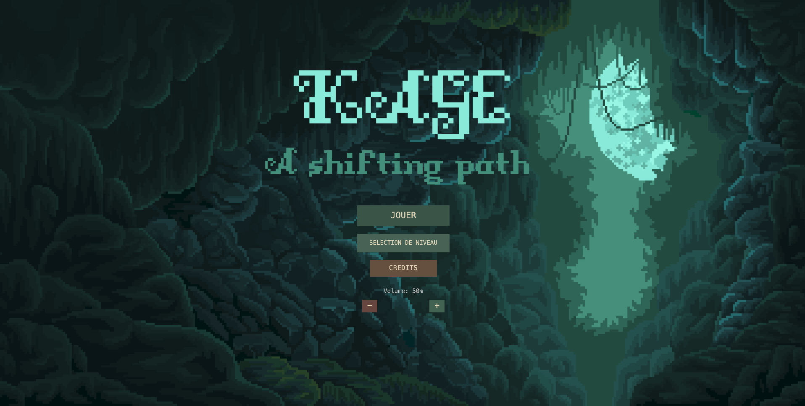
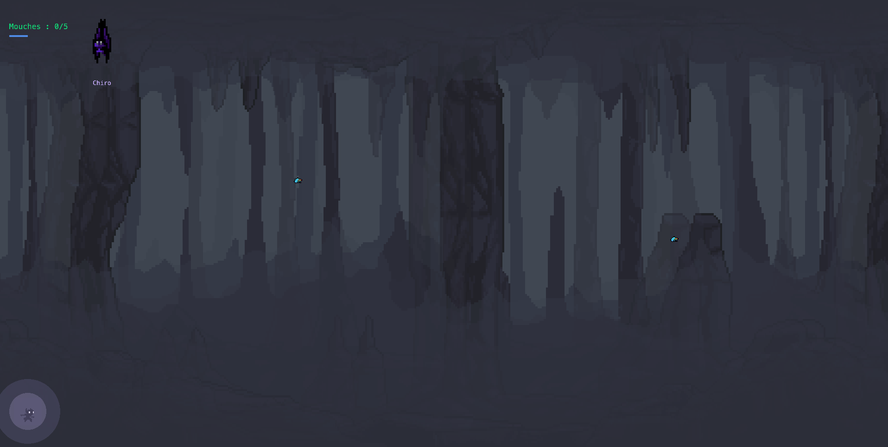
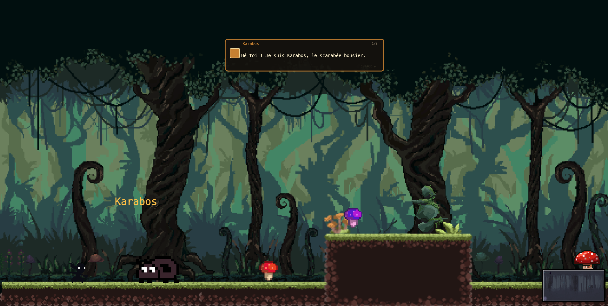
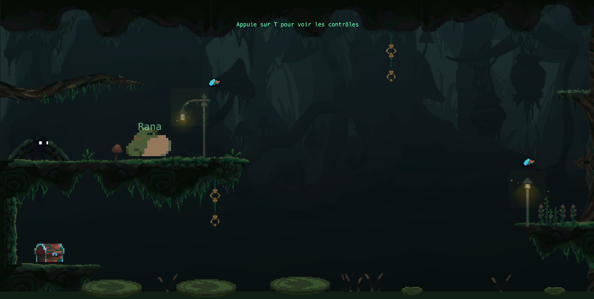
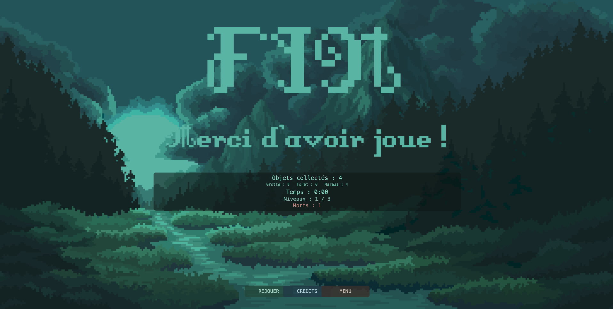

# KAGE — A Shifting Path

## 1. Description du projet

**KAGE** est un jeu de plateforme narratif en 2D développé en JavaScript avec la librairie [Kaplay.js](https://kaplayjs.com/).

En japonais, *kage* (影 ou 陰) signifie "ombre", "silhouette" ou "obscurité".
Le joueur incarne KAGE, une créature recluse ayant vécu toute son existence dans une grotte souterraine.
À la suite d'une catastrophe naturelle (tremblements de terre et inondation), son terrier est détruit. Contraint de quitter son refuge, KAGE part explorer un monde inconnu à la recherche d'un nouvel endroit où s'installer.

Le jeu repose sur une progression linéaire en trois niveaux, chacun introduisant une nouvelle capacité qui permet au joueur de s'adapter à son environnement :

- **Niveau 1 — L'Écho des Profondeurs (Caverne)**
  Incarner la chauve-souris pour voler à travers une caverne souterraine, utiliser l'écholocalisation (`E`) pour esquiver stalactites, stalagmites et éboulements.
- **Niveau 2 — Les Sentiers Enracinés (Forêt)**
  Incarner le scarabée pour charger et briser des obstacles (`SHIFT`), bondir et planer à travers une forêt ancestrale.
- **Niveau 3 — Le Marécage Oublié (Marais)**
  Incarner la grenouille pour charger ses sauts (`C`) et traverser des eaux sombres et des environnements instables.

Chaque niveau est introduit par un PNJ qui explique narrativement et mécaniquement la nouvelle capacité acquise.

Le jeu est encadré par :
- une cinématique d'introduction présentant le contexte et l'histoire,
- une cinématique de fin concluant le voyage de KAGE,
- un écran de fin affichant les statistiques de jeu (temps, objets collectés, morts, progression).

---

## 2. Captures du projet

---

## 3. Procédure d'installation et de lancement

Le projet n'étant pas hébergé en ligne, il doit être lancé localement.

### Pré-requis

- Un navigateur web moderne (Chrome, Firefox, Edge)
- Un serveur local (ex. **Live Server** dans VS Code)

### Lancement

1. Cloner ou télécharger le dépôt GitHub.
2. Ouvrir le dossier racine du projet dans Visual Studio Code.
3. S'assurer que le fichier `index.html` se trouve à la racine.
4. Lancer un serveur local (par exemple via l'extension Live Server).
5. Le jeu s'ouvre dans le navigateur.

---

## 4. Librairies, modules et scripts utilisés

| Technologie | Rôle |
|---|---|
| **[Kaplay.js](https://kaplayjs.com/)** (v3001.0.19) | Librairie JavaScript pour le développement de jeux 2D (scènes, collisions, caméra, inputs, UI) |
| **JavaScript (ES modules)** | Langage principal du projet |
| **HTML5 / Canvas** | Support d'affichage du jeu |

Aucune autre librairie externe n'est requise pour le fonctionnement du projet.

---

## 5. Ressources, licences et crédits

### Assets visuels

#### Tilesets et sprites

| Asset | Auteur | Source | Utilisation |
|---|---|---|---|
| Swamp Kingdom — Platformer Tileset | the14collective | [itch.io](https://14collective.itch.io/swamp-kingdom-platfomer-tileset) | Niveaux 2 et 3 (décors, plateformes, objets) |
| Bosses — Frogger | Admurin | [itch.io](https://admurin.itch.io/bosses-frogger) | Niveau 3 (PNJ grenouille, transformation grenouille) |

#### Backgrounds

| Asset | Auteur | Source | Utilisation |
|---|---|---|---|
| StoneMoon | Forest Elfs | [itch.io](https://forest-elfs.itch.io/stonemoon) | Background du menu principal |
| ForestMoon | Forest Elfs | [itch.io](https://forest-elfs.itch.io/forestmoon) | Background de l'écran de fin |
| Crystal Cave Pixel Art Backgrounds | CraftPix | [craftpix.net](https://craftpix.net/freebies/free-crystal-cave-pixel-art-backgrounds/?num=2&amp;count=28&amp;sq=cavern&amp;pos=1) | Niveau 1 (parallaxe caverne) |
| Nature Backgrounds Pixel Art | CraftPix | [craftpix.net](https://craftpix.net/freebies/free-nature-backgrounds-pixel-art/) | Décors nature |
| Forest and Trees Pixel Backgrounds | CraftPix | [craftpix.net](https://craftpix.net/freebies/forest-and-trees-free-pixel-backgrounds/) | Niveau 2 (forêt) |
| Underwater World Pixel Art Backgrounds | CraftPix | [craftpix.net](https://craftpix.net/freebies/free-underwater-world-pixel-art-backgrounds/) | Niveau 3 (marais/eau) |

> Licence CraftPix : [craftpix.net/file-licenses](https://craftpix.net/file-licenses/)

#### Police

| Asset | Auteur | Source |
|---|---|---|
| DungeonFont | vrtxrry | [itch.io](https://vrtxrry.itch.io/dungeonfont) |

### Musique

| Piste | Auteur | Source | Utilisation |
|---|---|---|---|
| Cave (musique niveau 1) | Spencer Y.K. | [Pixabay](https://pixabay.com/users/spencer_yk-36670691/) | Niveau 1 — L'Écho des Profondeurs |
| Little Slime's Adventure (musique niveau 2) | Spencer Y.K. | [Pixabay](https://pixabay.com/music/video-games-little-slimex27s-adventure-151007/) | Niveau 2 — Les Sentiers Enracinés |
| Lily Paddling Down the Stream (musique niveau 3) | Fablefly Music | [itch.io](https://fablefly-music.itch.io/lily-paddling-down-the-stream) | Niveau 3 — Le Marécage Oublié |
| Deep in the Dell (musique menu / fin) | Geoff Harvey | [Pixabay](https://pixabay.com/fr/users/geoffharvey-9096471/) | Menu principal et écran de fin |

### Effets sonores

| Son | Auteur | Source | Utilisation |
|---|---|---|---|
| Cave Droplets | Pixabay (non crédité) | [Pixabay](https://pixabay.com/sound-effects/film-special-effects-inside-a-cave-effect-240264/) | Niveau 1 — gouttes d'eau ambiantes |
| Earth Rumble | freesound_community | [Pixabay](https://pixabay.com/users/freesound_community-46691455/) | Introduction — tremblement de terre |
| Power Up Sparkle | floraphonic | [Pixabay](https://pixabay.com/fr/users/floraphonic-38928062/) | Effet de transformation |
| Sound Effects Pack | Pixabay | [Pixabay — Video Games SFX Collection](https://pixabay.com/collections/video-games-sfx-27925379/) | Divers effets sonores |

### Packs complémentaires (références / inspiration)

| Pack | Auteur | Source |
|---|---|---|
| 400 Sounds Pack | CI | [itch.io](https://ci.itch.io/400-sounds-pack) |
| Cute and Silly RPG Music Pack | chajamakesmusic | [itch.io](https://chajamakesmusic.itch.io/cute-and-silly-rpg-music-pack) |
| Caves, Mines and Dungeons Retro Music Pack | bb82dabn | [itch.io](https://bb82dabn.itch.io/caves-mines-and-dungeons-retro-music-pack) |
| Classic 16x16 Pixel Art Platformer Tileset | exploitdev | [itch.io](https://exploitdev.itch.io/classic-16x16-free-pixel-art-platformer-tileset) |
| Free Undead Tileset Top Down Pixel Art | Free Game Assets | [itch.io](https://free-game-assets.itch.io/free-undead-tileset-top-down-pixel-art) |

### Code

Le code du projet est original, à l'exception de :
- structures standards liées à Kaplay.js,
- principes courants de game design (puzzles, plateformes, collisions).

Les assets ont été réorganisés, découpés et intégrés pour correspondre aux besoins visuels et ludiques du projet. Toutes les licences des packs autorisent l'usage dans des projets gratuits et commerciaux, la modification, mais interdisent la revente ou redistribution des assets seuls.

---

## 6. Concept abandonné : La Taupe (Niveau 1)

Le concept initial du Niveau 1 reposait sur un personnage de **Taupe** qui enseignait au joueur à **creuser la terre** pour naviguer dans un environnement souterrain.

### Première itération — Grille de blocs (style Dome Keeper)

L'idée était de créer une caverne entièrement remplie de terre, composée d'une grille de blocs individuels que le joueur pouvait creuser un par un. Des pierres indestructibles parsemaient la grille pour forcer le joueur à trouver un chemin alternatif vers la sortie (en haut à droite).

**Problème rencontré :** La grille nécessitait environ **745 blocs de terre**, chacun possédant son propre composant de collision (`area()` et `body()`). Cette quantité massive d'entités physiques a provoqué des **chutes de framerate sévères** et une **consommation mémoire excessive**, rendant le jeu injouable (confirmé par le profiling Firefox). Kaplay.js n'est pas optimisé pour gérer autant de corps physiques simultanément.

### Deuxième itération — Défilement horizontal (style Kingdom: Two Crowns)

Pour résoudre le problème de performance, le niveau a été redesigné en **défilement horizontal** avec seulement ~80 blocs de terre. Le joueur avançait de gauche à droite en creusant des murs de terre, avec des piliers de pierre forçant des détours.

**Problème rencontré :** Le gameplay résultant était **trop linéaire et monotone** — le joueur n'avait qu'à avancer en ligne droite et creuser les murs sur son passage, sans réelle réflexion ni variété.

### Solution finale — La Chauve-souris (vol)

Face à ces limitations, le concept de la Taupe a été **entièrement abandonné** au profit d'une **Chauve-souris** enseignant le vol. Ce changement a résolu les deux problèmes :
- **Performance :** aucun bloc de terre à gérer, collision manuelle légère.
- **Gameplay :** le vol de type Flappy Bird combiné à des **tunnels rocheux** traversables à pied offre une variété et un rythme bien supérieurs, tout en restant accessible aux joueurs de 8-12 ans.

---

## 7. Usage des modèles de langage (LLM)

Des modèles de langage ont été utilisés dans le cadre du développement du projet.

### Modèles utilisés

- **Copilot** (Microsoft)
- **Claude** (Anthropic)

### Usages principaux

- Aide à la structuration du gameplay (progression par capacités)
- Assistance au débogage JavaScript / Kaplay.js
- Clarification de concepts techniques

### Nature de l'assistance

Les modèles de langage n'ont pas produit de code final autonome, mais ont servi :
- de support à la réflexion,
- d'assistant pédagogique.

L'ensemble des choix finaux (code, design, intégration) relève du développeur.

---

## 8. Contexte de développement

Ce projet a été développé dans le cadre d'un enseignement universitaire à l'**Université de Lausanne (UNIL)**, "Développement de jeu vidéo 2D" donné par **Loïc Catani** dans le domaine des sciences du langage et des humanités numériques.

---

## 9. Corrections et ajustements suite aux retours

Suite aux retours de test, plusieurs ajustements ont été apportés au jeu :

- **Touche `R` — Recommencer :** ajout d'un raccourci clavier `R` permettant de recommencer rapidement le niveau ou le menu en cours, sans passer par le menu de pause.
- **Corrections de hitbox :** plusieurs hitbox de plateformes et d'obstacles ont été réajustées (épaisseurs réduites, positions corrigées) pour éviter les blocages invisibles et les collisions imprévues.